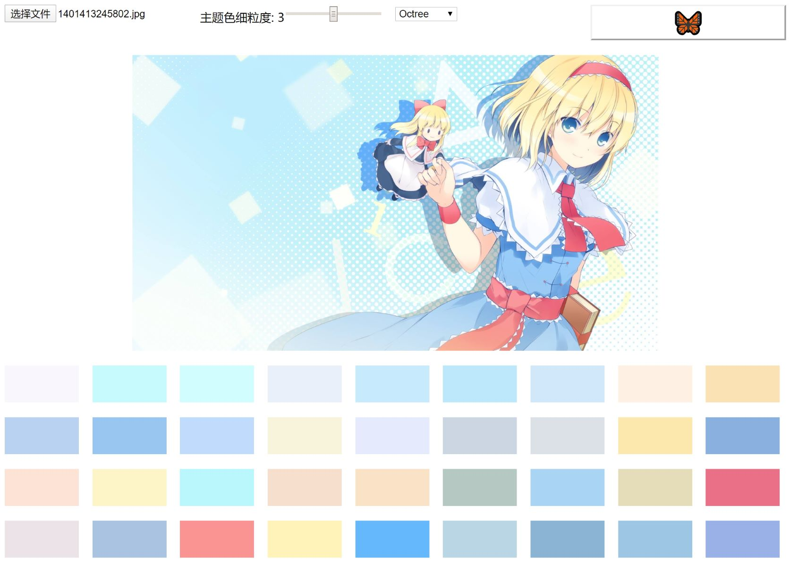

# 图片主题色提取算法与实现

## 简介

提取主题色的实质是对颜色进行量化的过程. 颜色量化是这样的一种操作, 将大量的颜色压缩到一个更小的范围, 常见应用是将一张高色深的图片(比如48bit)转换成低色深的图片(比如24bit), 并且尽量保持其原本的样貌. 提取主题色是更极端的操作, 将一张图片压缩至几个或几十个颜色.

## 八叉树提取法(Octree Algorithms)

最近拾起了很久以前买的书《Node.js来一打C++扩展》, 把学习怎么写Node addons的事情提上了日程.

在"前言"里偶遇到死月dalao介绍的["圣•白莲"](https://github.com/XadillaX/byakuren)(越共狂喜)主题色提取库, 好奇去看了一下, 顺便找到了博客地址, [这篇文章](https://xcoder.in/2017/03/03/byakuren/)介绍了其算法思想.

核心主要是"八叉树提取法", 八叉树的构建方式如图:

这里的八叉树深度为8, 每个节点最多8个子节点.

最末端的叶子前标数字为该颜色的数量.

图中示范了3个像素的存放, 通常一张图片不会填满整个八叉树, 除非人为构造.

在遍历图片后, 八叉树已经创建完成, 接着就要对像素进行合并了.

合并是深度优先的, 即由最末端开始, 其依据是最末端的各个像素颜色最相近. 比如#ffffff和#fefefe颜色是差不多的

最后得到所需的主题色数量取决于合并的层级数量, 所有的叶子即主题色. 由于每个叶子都有一个前标数字, 代表该颜色的数量. 所以需要对其排序, 由多到少, 符合视觉上"主题"的概念.

[实现: Octree.ts](src/app/utils/Octree.ts)

[参考](http://www.twinklingstar.cn/2013/491/octree-quantization/)

## 流行度算法(Popularity Algorithms)

这是一开始自己摸索出的一个算法, 后来看论文才发现已经有了这种算法了, 不过稍有偏差, 叫"Popularity Algorithms".

其思想非常简单

- 将RGB立方体划分为相当多而小的一系列立方体(自己摸索时选择2^n等分边)
- 扫描图片, 将像素填入对应立方体内
- 对每个立方体内颜色求均值(自己摸索时选择的是中位数), 即质心
- 每个立方体的颜色均值就是一种颜色, 从多到少排序, 就是主题色

[实现: Popularity.ts](src/app/utils/Popularity.ts)

[参考](https://web.cs.wpi.edu/~matt/courses/cs563/talks/color_quant/CQindex.html)

## 中位切分法(Median Cut Algorithms)

这是看到的另一个算法, 这里提一下. 类似"流行度算法", 主要是划分区域的方式不同.

步骤

- 将整张图片表示为一个RGB立方体
- 找到立方体的最长边(不是任意选边, 主要是因为从最长边分割更均匀)，从中位数的地方开始切割。得到两个包含几乎相同数量点的立方体
- 对分割出的立方体重复上一步的切割过程, 最终得到256个立方体
- 256个立方体的质心(均值)就是要压缩得的256个颜色值

[参考](https://www.myway5.com/index.php/2018/12/06/%E4%B8%AD%E4%BD%8D%E5%88%87%E5%88%86%E6%B3%95%E9%A2%9C%E8%89%B2%E9%87%8F%E5%8C%96/)
